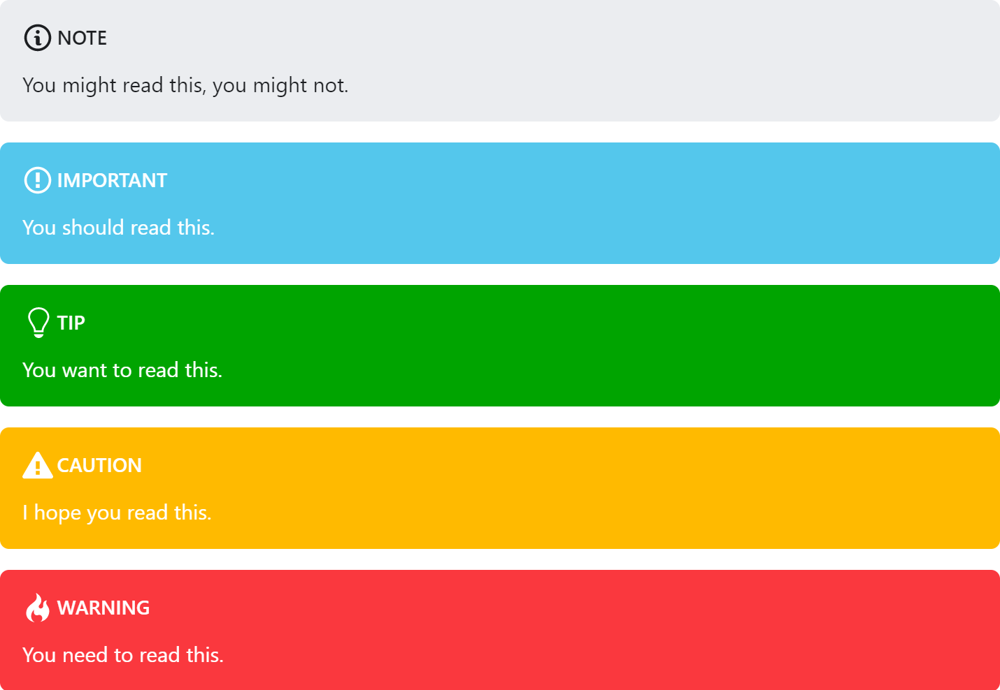

# remark-admonitions

A [remark](https://github.com/remarkjs/remark) plugin for admonitions with Docusaurus v2 support.


# Installation

`remark-admonitions` is available on NPM.

```bash
npm install remark-admonitions
```

## unified + remark
If you're using unified/remark, just pass the plugin to `use()`

For example, this will compile `input.md` into `output.html` using `remark`, `rehype`, and `remark-admonitions`.
```javascript
const unified = require('unified')
const markdown = require('remark-parse')
// require the plugin
const admonitions = require('remark-admonitions')
const remark2rehype = require('remark-rehype')
const doc = require('rehype-document')
const format = require('rehype-format')
const html = require('rehype-stringify')
const vfile = require('to-vfile')
const report = require('vfile-reporter')

const options = {}

unified()
  .use(markdown)
  // add it to unified
  .use(admonitions, options)
  .use(remark2rehype)
  .use(doc)
  .use(format)
  .use(html)
  .process(vfile.readSync('./input.md'), (error, result) => {
      console.error(report(error || result))
      if (result) {
        result.basename = "output.html"
        vfile.writeSync(result)
      }
  })
```

## Docusaurus v2

With Docusaurus v2, you'll have to add the plugin to `docusaurus.config.js` under the `presets.remarkPlugins`. Make sure to add the styles to your `custom.css`.

```javascript
const admonitions = require('remark-admonitions')
module.exports = {
  presets: [
    [
      '@docusaurus/preset-classic',
      {
        docs: {
          // docs folder path relative to website dir.
          path: './docs',
          // sidebars file relative to website dir.
          sidebarPath: require.resolve('./sidebars.json'),
          // remark-admonitions
          remarkPlugins: [
            [
              admonitions,
              /* plugin options */
              {

              }
            ]
          ]
        },
        theme: {
          customCss: require.resolve('./static/css/custom.css'),
        }
      },
    ],
  ],
}
```

# Usage

Admonitions are a block element. 
The titles can include inline markdown and the body can include any block markdown except another admonition.

The general syntax is

```markdown
:::keyword optional title
some content
:::
```

For example,

```markdown
:::tip pro tip
`remark-admonitions` is pretty great!
:::
```


The default keywords are `important`, `tip`, `note`, `warning`, and `danger`.

# Options

The plugin can be configured through the options object.

## Defaults

```ts
const options = {
  customTypes: customTypes, // additional types of admonitions
  tag: string, // the tag to be used for creating admonitions (default ":::")
  icons: "svg"|"emoji"|"none", // the type of icons to use (default "svg")
}
```

## Custom Types

The `customTypes` option can be used to add additional types of admonitions. You can set the svg and emoji icons as well as the keyword. You only have to include the svg/emoji fields if you are using them.

```ts
const customTypes = {
  [string: keyword]: {
    emoji: string,
    svg: string,
  }
}
```

For example, this will allow you to generate admonitions will the `custom` keyword.

```js
customTypes: {
  custom: {
    emoji: '💻',
    svg: '<svg xmlns="http://www.w3.org/2000/svg" width="16" height="16" viewBox="0 0 16 16"><path fill-rule="evenodd" d="M15 2H1c-.55 0-1 .45-1 1v9c0 .55.45 1 1 1h5.34c-.25.61-.86 1.39-2.34 2h8c-1.48-.61-2.09-1.39-2.34-2H15c.55 0 1-.45 1-1V3c0-.55-.45-1-1-1zm0 9H1V3h14v8z"></path></svg>'
  }
}
```

The generated markup will include the class `admonition-{keyword}` for styling.

# Styling

You'll have to add styles for the admonitions. With Docusaurus, these can be added to `custom.css`. 

## Classic (Docusaurus v1)


```css
.admonition {
  margin-bottom: 1em;
  padding: 15px 30px 15px 15px;
}

.admonition h5 {
  margin-top: 0;
  margin-bottom: 8px;
  text-transform: uppercase;
}

.admonition-icon {
  display: inline-block;
  vertical-align: middle;
  margin-right: 0.2em;
}

.admonition-icon svg {
  display: inline-block;
  width: 22px;
  height: 22px;
  stroke-width: 0;
}

.admonition-content > :last-child {
  margin-bottom: 0;
}

/* default for custom types */
.admonition {
  background-color: rgba(118, 51, 219, 0.1);
  border-left: 8px solid #7633db;
}

.admonition h5 {
  color: #7633db;
}

.admonition .admonition-icon svg {
  stroke: #7633db;
  fill: #7633db;
}

/** native types */
.admonition-warning {
  background-color: rgba(230, 126, 34, 0.1);
  border-left: 8px solid #e67e22;
}

.admonition-warning h5 {
  color: #e67e22;
}

.admonition-warning .admonition-icon svg {
  stroke: #e67e22;
  fill: #e67e22;
}

.admonition-tip {
  background-color: rgba(46, 204, 113, 0.1);
  border-left: 8px solid #2ecc71;
}

.admonition-tip h5 {
  color: #2ecc71;
}

.admonition-tip .admonition-icon svg {
  stroke: #2ecc71;
  fill: #2ecc71;
}

.admonition-caution {
  background-color: rgba(231, 76, 60, 0.1);
  border-left: 8px solid #e74c3c;
}

.admonition-caution h5 {
  color: #e74c3c;
}

.admonition-caution .admonition-icon svg {
  stroke: #e74c3c;
  fill: #e74c3c;
}

.admonition-important {
  background-color: rgba(52, 152, 219, 0.1);
  border-left: 8px solid #3498db;
}

.admonition-important h5 {
  color: #3498db;
}

.admonition-important .admonition-icon svg {
  stroke: #3498db;
  fill: #3498db;
}

.admonition-note {
  background-color: rgba(241, 196, 15, 0.1);
  border-left: 8px solid #f1c40f;
}

.admonition-note h5 {
  color: #f1c40f;
}

.admonition-note .admonition-icon svg {
  stroke: #f1c40f;
  fill: #f1c40f;
}
```

## Infima (Docusaurus v2)



```css
/* Based on the styling for alerts */
.admonition {
  background-color: var(--ifm-alert-background-color);
  border: var(--ifm-alert-border-width) solid var(--ifm-alert-border-color);
  border-radius: var(--ifm-alert-border-radius);
  box-sizing: border-box;
  color: var(--ifm-alert-color);
  padding: var(--ifm-alert-padding-vertical) var(--ifm-alert-padding-horizontal);
  margin-bottom: 1em;
}

.admonition h5 {
  margin-top: 0;
  margin-bottom: 8px;
  text-transform: uppercase;
}

.admonition-icon {
  display: inline-block;
  vertical-align: middle;
  margin-right: 0.2em;
}

.admonition-icon svg {
  display: inline-block;
  width: 22px;
  height: 22px;
  stroke-width: 0;
}

.admonition-content > :last-child {
  margin-bottom: 0;
}

.admonition .admonition-icon svg {
  stroke: var(--ifm-alert-color);
  fill: var(--ifm-alert-color);
}

/* default for custom types */

.admonition {
  --ifm-alert-background-color: var(--ifm-color-primary)
}

/* styles for native types */

.admonition-important {
  color: var(--ifm-alert-color);
  background-color: var(--ifm-alert-background-color);
  border-color: var(--ifm-alert-background-color)
}

.admonition-tip {
  --ifm-alert-background-color: var(--ifm-color-success)
}

.admonition-important, .admonition-tip {
  color: var(--ifm-alert-color);
  background-color: var(--ifm-alert-background-color);
  border-color: var(--ifm-alert-background-color)
}

.admonition-important {
  --ifm-alert-background-color:var(--ifm-color-info)
}

.admonition-warning {
  --ifm-alert-background-color:var(--ifm-color-warning)
}

.admonition-note {
  --ifm-alert-background-color:var(--ifm-color-secondary);
  color: var(--ifm-color-gray-900);
}

.admonition-note .admonition-icon svg {
  fill: var(--ifm-color-gray-900);
  stroke: var(--ifm-color-gray-900);
}

.admonition-caution,.admonition-warning {
  color: var(--ifm-alert-color);
  background-color: var(--ifm-alert-background-color);
  border-color: var(--ifm-alert-background-color)
}

.admonition-caution {
  --ifm-alert-background-color:var(--ifm-color-danger)
}
```

# Credit

Syntax and classic theme based on [`remarkable-admonitions`](https://github.com/favoloso/remarkable-admonitions).

The SVG icons included are from [GitHub Octicons](https://octicons.github.com).